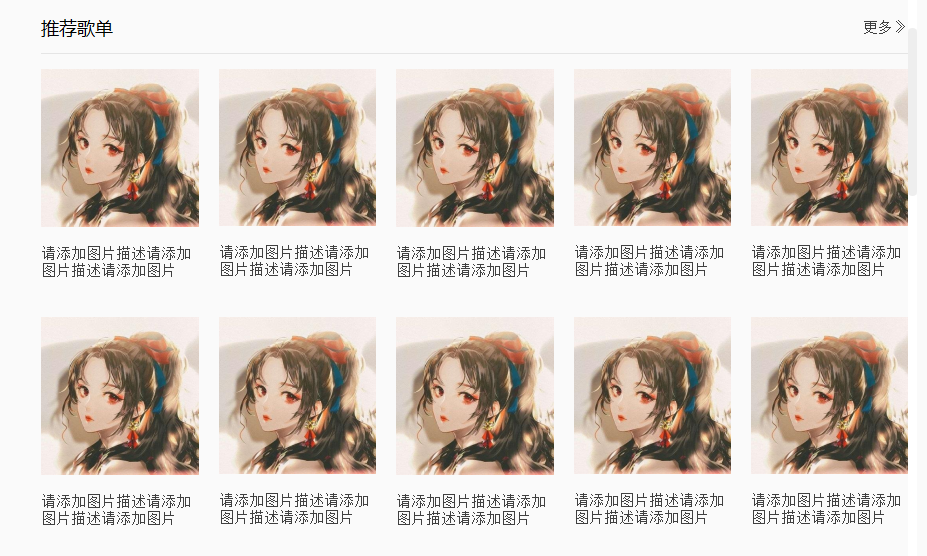

##作用
用来存放各种弹窗，比如点击昵称的弹窗，播放列表弹窗等等
##文件说明
文件名|窗口截图|文件描述|实现思路
------------------|------------------------------------------|-------------------|----------------------
CBanner.py|&nbsp;&nbsp;&nbsp;&nbsp;&nbsp;&nbsp;&nbsp;&nbsp;&nbsp;&nbsp;&nbsp;&nbsp;&nbsp;&nbsp;&nbsp;&nbsp;&nbsp;&nbsp;&nbsp;&nbsp;&nbsp;&nbsp;&nbsp;&nbsp;&nbsp;&nbsp;&nbsp;&nbsp;&nbsp;&nbsp;&nbsp;&nbsp;&nbsp;&nbsp;&nbsp;&nbsp;&nbsp;&nbsp;&nbsp;&nbsp;&nbsp;&nbsp;&nbsp;&nbsp;&nbsp;&nbsp;&nbsp;&nbsp;&nbsp;&nbsp;&nbsp;&nbsp;&nbsp;&nbsp;&nbsp;&nbsp;&nbsp;&nbsp;&nbsp;&nbsp;&nbsp;&nbsp;&nbsp;|轮播图的实现|这里只说名轮播图大于3张图片的实现思路： 1.用setGeometry初始化每个图片的位置,默认第一张放中间，最后一张放左边，第二张放右边，其他放也放中间， 但是让第一张用raise_()方法在最上层显示，将这些图片都放入CommanHelper的双循环链表中。 2.创建动画组，对每一张图片的geomtry属性设置动画，startvalue就是图片当前位置， endvalue就是图片移动后的位置
CImageListWidget.py||图片列表：包含标题（可随意更改或者隐藏）、图片和图片文字说明|标题Ui这里不描述， body部分用一个网格布局，为了使主窗口放大时图片也同步放大， 需要在resizeEvent中获取图片的宽，然后高度按同样比例放大， 最后为每一个imageitem设置点击事件，发出clicked信号即可
CircularButton.py||圆形按钮：可用于圆形图像|比较简单，不做说明
ClistWidgetItem.py||自定义QlistWidget的item，左边图片只显示了其中一种， 所有的QListWidget自定义的item都写在这个类|比较简单，不做说明
CSearchEdit.py||自定义搜索框|用一个编辑框和一个按钮放在水平布局， 然后通过qss改变样式就可以实现