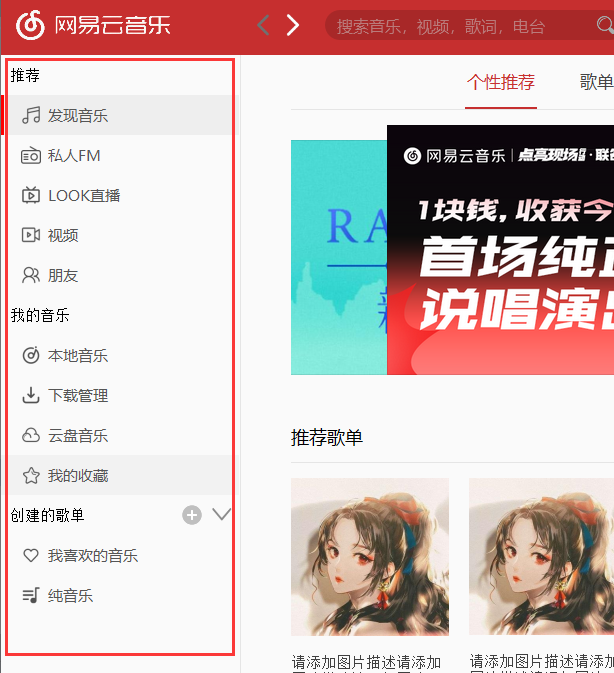
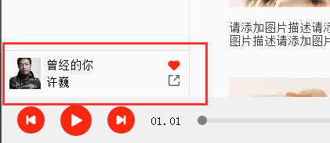

##作用
用来存放主窗口Ui，比如左侧导航栏及其每一栏控件（如发现音乐），主窗口等
##文件说明
文件名|窗口截图|文件描述
------------------|------------------------------------------|-------------------
FindMusicUi     |无|发现音乐内容太多，所以单独创建了一个包，包里面的FindMusic.py包含了整个发现音乐的布局
CallMainWin.py||综合了所有ui和逻辑，是程序入口
MainWindow.py |无|用designer生成的，包括顶部标题栏和底部播放栏
Ui_LeftNavigation.py||左侧导航栏的界面实现
Ui_Playing.py||显示正在播放的音乐界面